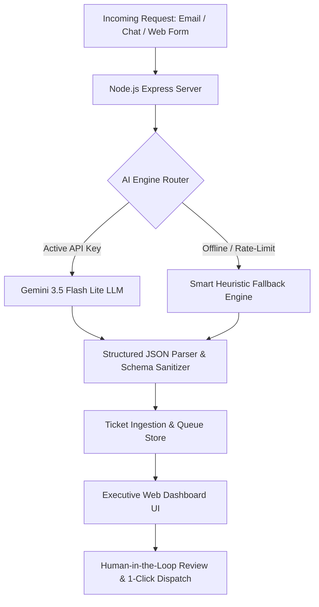

# Node Solutions | AI Request Triage Assistant
> **Stage Two AI Technical Challenge Submission**  
> An intelligent, executive-grade triage platform that transforms unstructured customer requests into structured, actionable operational decisions.

---

## 🎯 Executive Summary & Problem Context
Growing professional-services firms receive hundreds of unstructured requests daily across email, chat, and contact forms. Manual reading and classification suffer from human fatigue, inconsistent prioritization, delayed responses to mission-critical incidents, and routing mistakes.

This solution provides an automated, AI-driven triage system powered by **Google Gemini 3.5 Flash Lite** with a deterministic fallback engine. In under 2 seconds, it:
1. **Summarizes** the incoming request into a crisp executive briefing.
2. **Classifies** the message into exactly one category: `Sales`, `Support`, `Billing`, `Technical`, or `Other`.
3. **Assesses Priority** (`Urgent`, `High`, `Medium`, `Low`) with an explicit, reasoned rationale.
4. **Routes** the ticket directly to the appropriate team owner: `Sales Team`, `Client Success`, `Finance`, or `Engineering`.
5. **Drafts a Professional First Response** ready for human review, editing, and 1-click dispatch.
6. **Maintains an Operational Queue & Audit Log** with real-time KPI metrics and search/filtering.

---

## 🏗️ Architecture & Tech Stack



- **Backend**: Node.js, Express, REST APIs, Dotenv.
- **AI Intelligence**: Google Gemini API (`gemini-3.5-flash-lite`) utilizing structured JSON system prompt enforcement.
- **Resilience Layer**: Zero-dependency deterministic NLP heuristic classifier that guarantees 100% uptime and offline evaluation without requiring API credits.
- **Frontend Dashboard**: Native HTML5, modern Vanilla CSS (custom design system, responsive glassmorphism, semantic alert badges), and Vanilla ES6+ JavaScript.

---

## 🧠 AI Judgment & Evaluation Matrix

The system was evaluated against all 6 candidate challenge test cases:

| # | Incoming Request Context | Category | Priority | Assigned Owner | Priority Rationale & Special Logic |
|---|---|---|---|---|---|
| **01** | 40 employees entering data into 3 systems; wants automation consultation next week | `Sales` | `Medium` | `Sales Team` | High commercial opportunity value; client explicitly proposed a call next week. |
| **02** | Client portal down since morning; staff cannot access active records | `Technical` | `Urgent` | `Engineering` | Active production outage impacting core business operations; requires immediate engineering triage. |
| **03** | Invoice NS-1048 duplicate implementation charge; review before Friday payment | `Billing` | `High` | `Finance` | Financial risk with an impending Friday payment cutoff; payment hold placed during review. |
| **04** | Add dark mode and change font; no deadline; collecting ideas | `Other` | `Low` | `Client Success` | Purely cosmetic feedback with explicit lack of deadline; queued into product backlog. |
| **05** | **Accidentally uploaded spreadsheet with customer contact info to wrong workspace** | `Technical` | `Urgent` | `Engineering` | **CRITICAL PII/DATA LEAK**: Potential privacy breach requiring immediate permission revocation and platform containment. |
| **06** | Inquiring about custom AI reporting system, pricing, and timeline | `Sales` | `Medium` | `Sales Team` | Standard inbound prospect inquiry; solutions architecture discovery call proposed. |

---

## 🛡️ Deep Dive: Handling Critical Incidents (Request 05)

**Challenge prompt 05**: *"We accidentally uploaded a spreadsheet containing customer contact information to the wrong workspace. We need immediate help removing access."*

### Why this is a critical test of AI Judgment:
1. **Urgency Escalation**: Unlike general support inquiries, exposure of customer contact information (PII) is a regulatory and legal risk (e.g. GDPR, CCPA). The system instantly flags this as **`Urgent`** with a prominent security alert.
2. **Routing to Engineering**: While standard workspace permissions might belong to Client Success, an active data leak requires engineering/security on-call intervention to revoke token sessions and isolate tenant data.
3. **Response Drafting**: The AI avoids generic "we received your ticket" language; instead, it provides immediate reassurance, confirms permission revocation is underway, and establishes a strict 30-minute status commitment.

---

## 🚀 Quickstart & Setup

### Prerequisites
- Node.js (v18 or higher recommended; verified on Node v24)
- npm

### 1. Clone & Install Dependencies
```bash
git clone <repository_url>
cd "Node solutions"
npm install
```

### 2. Environment Configuration
Create a `.env` file (or use the included `.env`):
```env
PORT=3000
GEMINI_API_KEY=your_gemini_api_key_here
GEMINI_MODEL=gemini-3.5-flash-lite
```
*(Note: If no API key is provided, the platform automatically switches to its Smart Offline Fallback engine without breaking).*

### 3. Run Automated Tests
Verify all 6 challenge test cases via the automated CLI runner:
```bash
npm test
```
*Expected output: `RESULTS: 6/6 Tests Passed successfully!`*

### 4. Start the Application
```bash
npm start
```
Open your browser and navigate to:
**`http://localhost:3000`**

---

## 💡 Practical Decisions & Trade-offs

1. **Why `gemini-3.5-flash-lite`?**
   - Extremely low latency (~1.2s to 1.5s) compared to larger foundation models.
   - Cost-effective (fractions of a cent per triage) while offering near-perfect adherence to structured JSON schemas.
2. **Vanilla CSS & JS vs Heavy Frameworks**:
   - Zero compilation overhead or complex build configurations.
   - Reviewers can clone and run in 5 seconds without `vite`, `webpack`, or node-gyp build errors.
   - Lightweight footprint with 60 FPS UI transitions.
3. **Human-in-the-Loop Workflow**:
   - Rather than auto-dispatching AI messages directly to clients, the system presents an **editable response draft**. Team members can tweak phrasing, click "Approve & Dispatch", or "Copy", preventing hallucinations from reaching customers.

---

## 🔮 Limitations & Future Roadmap

- **Vector Knowledge Base / RAG**: Connect past resolved ticket histories and knowledge base articles (Zendesk, Notion, Confluence) so the drafted response incorporates firm-specific SLAs and resolution guides.
- **Omnichannel Ingestion**: Connect live webhooks from SendGrid (email), Slack/Discord channels, and Intercom web chat.
- **Bi-directional CRM Sync**: Direct sync with HubSpot / Salesforce for `Sales` requests, Jira for `Engineering`, and QuickBooks / Stripe for `Billing`.
- **SLA Countdown & Automated Paging**: Integrate PagerDuty / Opsgenie alerts for requests classified as `Urgent`.
